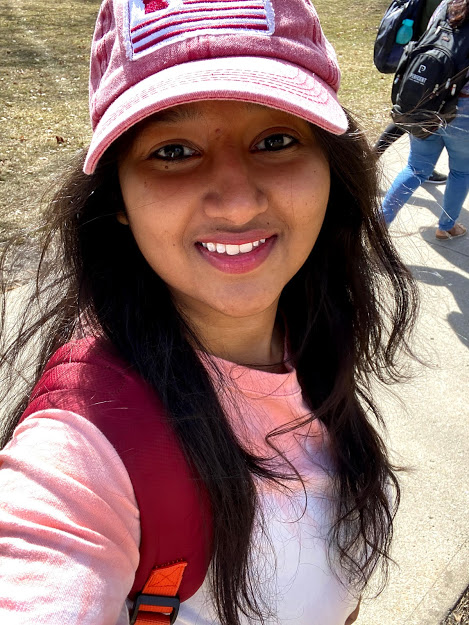

# Sushmita

## Current:
I am currently in the final semester of my Master's program in Applied Computer Science. I will be graduating this December.

## Background:
I am from Southern part of India. I have completed my under-graduation in Electronics and Communications. Later, I worked for a couple of years as a MS SQL DB Administrator for Accenture. My hobbies include watching movies and painting.

## Plans: 
I am hoping to build a career in Web development. As I have a previous work experience on MS SQL Server, I also want to explore Big data.

## Links: 
You can connect with me via LinkedIn by clicking on link:
https://www.linkedin.com/in/sushmita-rudra-15774a13b/ 

Here's a picture of me,

